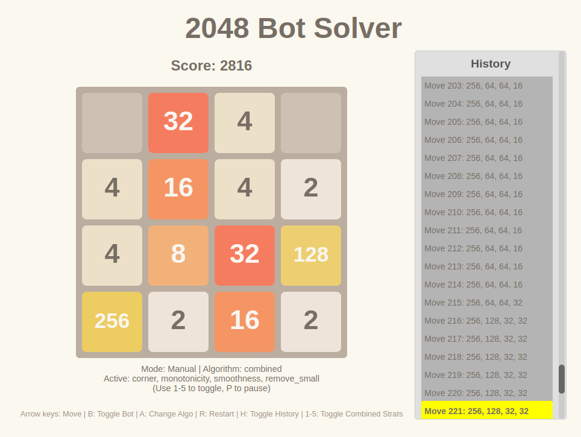

# js_2048_bot_solver

## Play it now: https://pemmyz.github.io/js_2048_bot_solver/

# 2048_bot_solver (HTML5/JavaScript Edition)  
🧠 A smarter, richer 2048 experience — now in the browser!

A feature-rich and extendable version of the classic **2048 game** built using **JavaScript, HTML5, and Canvas**, featuring:

- 🎮 Manual play or intelligent bot play
- 🧠 Multiple AI strategies (Expectimax, MCTS, Greedy, Heuristic, etc.)
- 📜 Move history panel with scroll and branching support
- 🔁 Undo support after game over
- 🧩 Toggleable combined strategies with weighting
- 📊 Scrollable history of moves with tile summary

---

## 📸 Screenshots

<!-- You can add image links here -->
<!--  -->

---

## 📦 Features

- **Manual Play**: Use arrow keys or swipe (mobile) to play 2048 normally.
- **Bot Mode**: Let the AI play for you using different strategies.
- **Multiple AI Algorithms**:
  - Random
  - Greedy
  - Expectimax (depth 2)
  - MCTS (Monte Carlo Tree Search)
  - Heuristic-based
  - Remove-small-tiles strategy
  - Combined strategy with toggleable evaluation heuristics
- **History Panel**:
  - Shows top 4 tiles per move
  - Scrollable and clickable for time-travel
  - Highlights branches after undo
- **Undo Functionality** even after game over
- **Keyboard Toggles** to switch bots and strategies

---

## 🕹️ Controls

| Key / Action | Function                                                                  |
|--------------|---------------------------------------------------------------------------|
| `↑ ↓ ← →`    | Move tiles (manual play)                                                  |
| `B`          | Toggle bot/manual mode                                                    |
| `A`          | Cycle bot algorithm                                                       |
| `R`          | Restart game                                                              |
| `U`          | Undo last move (even after game over)                                     |
| `1`–`5`      | Toggle heuristics in combined bot (see below)                             |
| `H`          | Show/hide history panel                                                   |
| 🖱️ Mouse     | Click history to time-travel to that state                                |
| 🖱️ Scroll    | Use mouse wheel/scrollbar to navigate long histories                      |
| 📱 Mobile    | Touch controls for moves and scrolls supported (if enabled)               |

---

## 🧠 Combined Bot Strategy

You can toggle and reorder five heuristics to customize the combined bot:

- **Empty**: Maximize empty tiles
- **Corner**: Keep max tile in bottom-right
- **Monotonicity**: Prefer rows/cols sorted in order
- **Smoothness**: Prefer neighboring tiles with similar values
- **Remove Small**: Prefer moves that remove low-value tiles

Each strategy can be enabled/disabled on the fly. Default weight is `1.0` per active heuristic.

---

## 📌 TODOs (Optional Enhancements)

- Adjustable weights for heuristics during gameplay  
- Save/load game state with localStorage  
- Bot vs Bot tournaments with stats  
- Charts for move efficiency / high tile tracking

---

## 🛠️ Tech Stack

- HTML5 Canvas
- Vanilla JavaScript
- CSS for UI

No frameworks or dependencies needed — just open `index.html` in your browser.

---

## 🤖 AI Assistance Disclaimer

This game was built with the assistance of AI tools (like ChatGPT) for:

- Design & architectural suggestions  
- Debugging and optimization  
- Brainstorming game features  
- Writing this README and boosting morale  

But all code decisions and final implementations were made by a human (that’s me!).  
Consider it a tag-team project between brain and bot.

---

